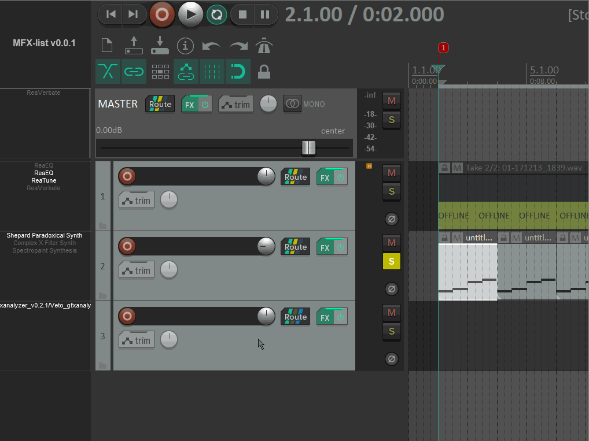

# MFXlist
This is a script for the Reaper DAW (digital audio workstation), that adds an FX strip to the left of the TCP for quick and easy access. The original idea comes from Doppelganger's fxlist (https://forum.cockos.com/showthread.php?t=210987), but this is a native ReaScript re-implementation of the FX strip part of fxlist. Just like fxlist, MFXlist packages existing functionality into a better (in my opinion) user interface compared to the existing native implementation; the used screen estate is simply smaller. Doppelganger's fxlist is still functional, but is no longer maintained, which is why I wrote MFXlist.

MFXlist consists of roughly 1300 lines of Lua code, and was developed on Windows, and Reaper v6.19/x64. It uses the js_ReaScriptAPI extension (https://forum.cockos.com/showthread.php?t=212174), which is apparently available also for Linux and Mac, so the script should work also on those systems, but I have not tried it on either of them. 

## Installation

Just download the MFXlist.lua file from the GitHub repo https://github.com/martinfabian/MFXlist and place it in Reaper's Scripts folder. 

The easiest way to install js_ReaScriptAPI is through ReaPack (https://reapack.com/). Download the ReaPack suitable for your system, put the file in Reaper's UserPlugins folder. Start Reaper, pull down the Extensions menu, and open ReaPack. There you can search for js_ReaScriptAPI, right-click it and install. You will have to restart Reaper.

Once that is set up, open Reaper's action list, click New action..., then Load ReaScript..., you get a file dialog where you can select MFXlist.lua. After loading it, if you do not see it in the action list, type "MFX" in the filter bar and it should come up. You start it by double-clicking it, just as any script.

## First time

The first time MFXlist starts up it docks itself into whatever docker Reaper regards as number 513 on your system. For some reason this differs from system to system, so you will probably have to drag it to the docker at the left of the arrange view, to the left of the TCP. MFXlist will remember its last docking position, so this should only be necessary the first time.

SWS has a handy action "SWS/S&M: Set global startup action" that allows you to set a startup action by entering the command ID into the dialog box that appears when you run the SWS action. You get the command ID of MFXlist by right-clicking on the MFXlist action and choosing "Copy selected action command ID". I use that SWS action to run MFXlist on Reaper startup.

## User interface

MFXlist relies on mouse and modifier keys (Shift, Ctrl, Alt). Clicking on an FX toggles open/close its floating window. Shift+click on an FX toggles bypass. Ctrl+click on an FX toggles open/close the FX chain for the track that FX is on. Alt+click on an FX removes it from the FX chain.

Clicking in the track area below any FX toggles open/close the Add FX to track dialog. Ctrl+click toggles open/close the FX chain dialog for that track. 

Drag-drop of an FX without Ctrl held down, moves the FX between tracks or within a track. Drag-drop of an FX with Ctrl held down, copies the FX. Move and copy are indicated by different colors of the drop indicator.

MFXlist handles scroll wheel messages, with and without modifier keys, though not (yet) exactly in the same way as scroll wheeling on the TCP.

## Customization

Since this is a script, you can customize it to your heart's content. Just like any programmer I am fully convinced that my code is self-documenting, but I have anyway included comments that might be useful for customization; just look at the code, the easiest customizable stuff is at the top.

## Enhancements

Ideas are welcome. One thing that I am looking at is to have the possibility of shortcuts in the header. A list of action command IDs could be given, and these commands can the be available in the header to invoke by a click.

## Known issues

There is a known issue with focus stealing in certain cases. This means that sometimes MFXlist steals the keyboard input so that key strokes do not go to Reaper, so keyboard shortcuts do not work. Clicking somewhere in the arrange view or on the TCP fixes this. I know what the problem is, I am just not sure how to fix it without affecting other focus related things that currently do work.

## Unknown issues

Please report to me. Posting in this thread will work.